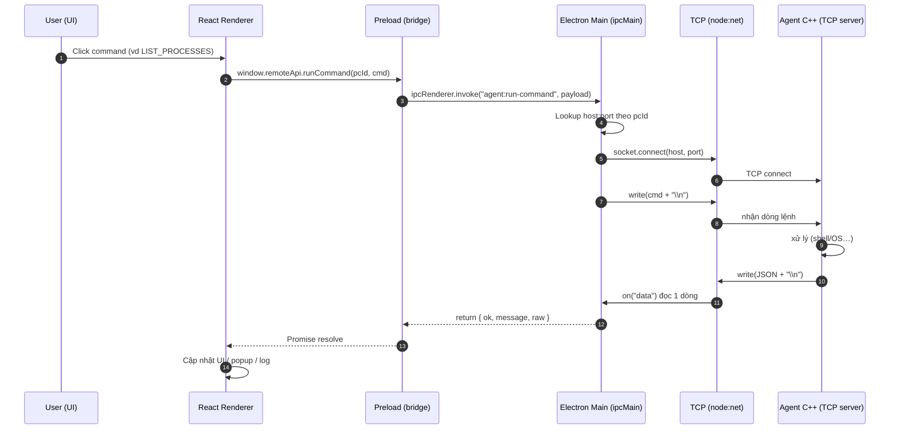
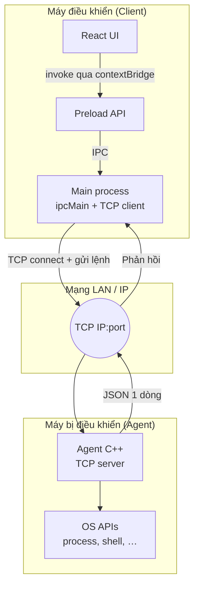

# Kiến trúc giao tiếp Client ↔ Agent

## Cách “FE nói chuyện” với “BE” trong project này

| Lớp | Vai trò | Công nghệ |
|-----|---------|-----------|
| **UI (FE)** | Giao diện React trong Electron **renderer** | React, `window.remoteApi` |
| **Cầu nối** | Không cho renderer gọi trực tiếp Node/OS; chỉ expose API an toàn | `preload.ts` + `contextBridge` |
| **Main (Electron)** | Chạy TCP client, giữ IPC handlers | `ipcMain.handle`, `node:net` |
| **Agent (BE thật)** | Server TCP trên máy bị điều khiển, thực thi lệnh | C++ (`agent`) |

**Phương thức kết nối giữa máy điều khiển và máy bị điều khiển:** **TCP socket** (plain text: một dòng lệnh `\n`, một dòng JSON trả lời).  
Không phải HTTP REST trong code hiện tại; **Electron IPC** chỉ nội bộ trong app desktop (renderer ↔ main).

---

## Sequence diagram (Mermaid)

---

## Flowchart — luồng tổng quát (Mermaid)

---

## Tóm tắt “back and forth”

1. **Trong Electron:** React → `preload` → `ipcMain` (một vòng request/response IPC).
2. **Ra ngoài máy:** `main` mở **TCP** tới `host:port` của Agent, gửi lệnh, nhận JSON.
3. **Agent:** parse lệnh → làm việc với OS → trả JSON.

Nâng cấp sau này có thể thêm **TLS**, **token auth**, hoặc **WebSocket** — kiến trúc IPC + remote TCP vẫn giữ nguyên ý tưởng.
